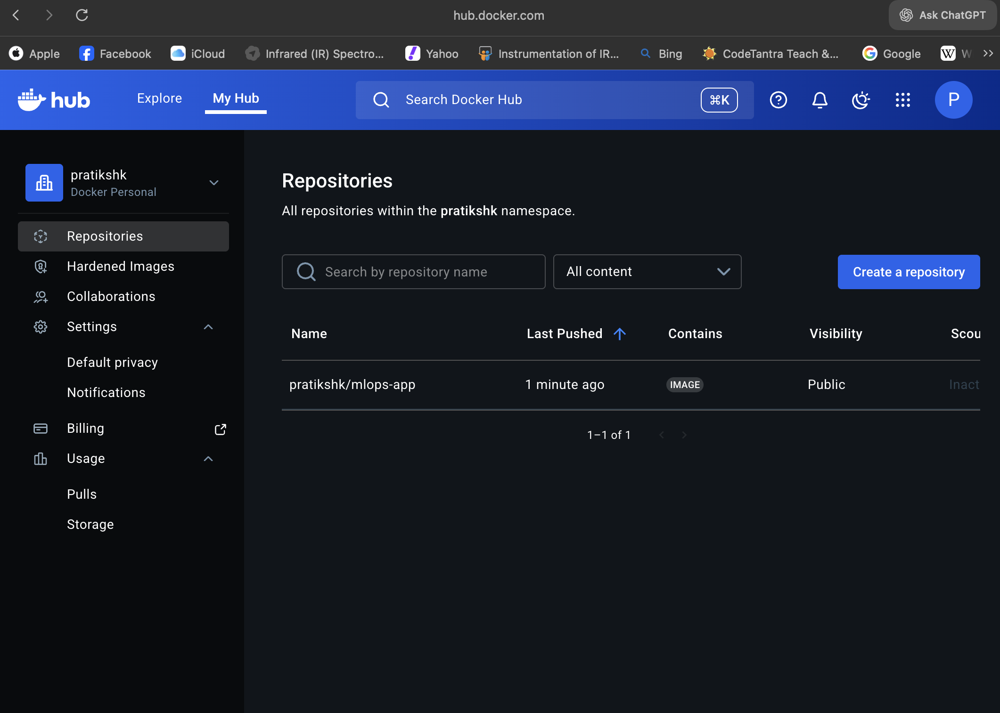
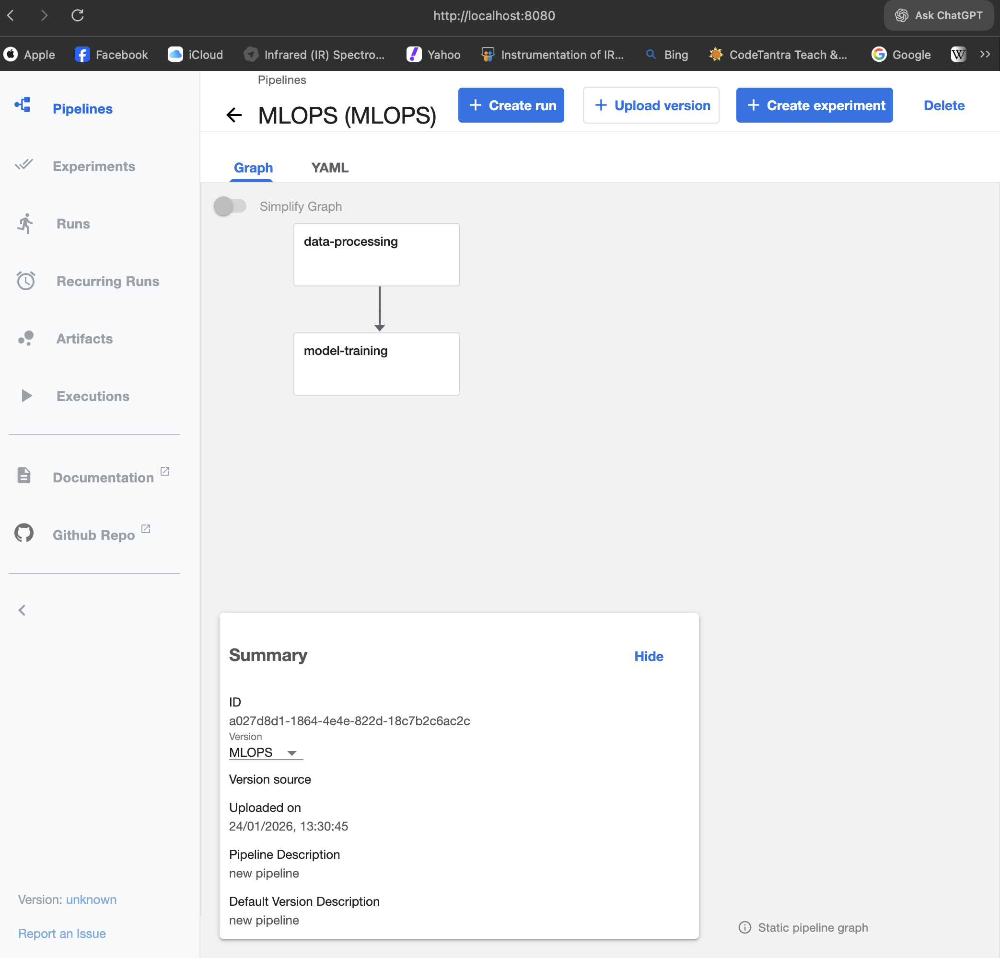
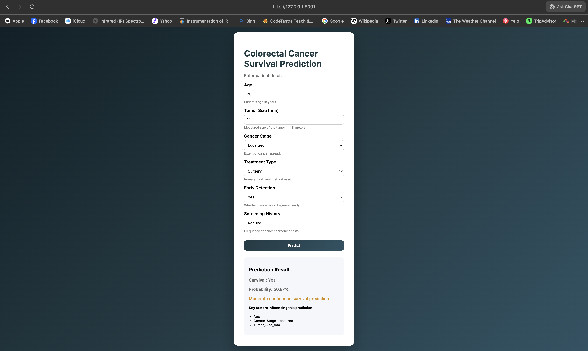
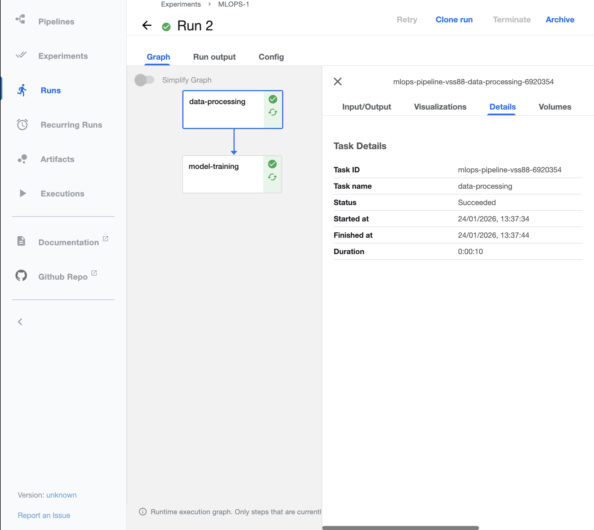

# Colorectal Cancer Survival Prediction – End-to-End MLOps Pipeline with Kubeflow

An end-to-end **Machine Learning + MLOps system** for colorectal cancer survival prediction, featuring:

* Production-grade data preprocessing & model training pipelines
* Experiment tracking with **MLflow**
* Containerized execution using **Docker**
* Orchestration using **Kubeflow Pipelines (KFP)**
* Interactive **Flask web application** for inference
* Artifact management and reproducible training workflows

This project demonstrates real-world ML system design, pipeline orchestration, and deployment practices.

---

## 🔬 Problem Statement

Predict the **survival outcome** of colorectal cancer patients using structured clinical features such as:

* Age
* Tumor size
* Cancer stage
* Treatment type
* Early detection
* Screening history

The goal is not just model accuracy, but building a **reproducible, scalable, production-ready ML system**.

---

## 🏗️ System Architecture

```
Raw Dataset
   │
   ▼
Data Processing Pipeline (KFP Component)
   │
   ├─ Feature Engineering
   ├─ One-Hot Encoding
   ├─ Standard Scaling
   └─ Train/Test Split
   │
   ▼
Model Training Pipeline (KFP Component)
   │
   ├─ Logistic Regression Training
   ├─ Threshold Optimization
   ├─ Evaluation Metrics
   └─ MLflow Logging
   │
   ▼
Model Artifacts (joblib)
   │
   ▼
Flask Web Application (Inference)
```

---

## ⚙️ Tech Stack

| Layer               | Tools                              |
| ------------------- | ---------------------------------- |
| Language            | Python 3.11                        |
| ML                  | Scikit-learn                       |
| Experiment Tracking | MLflow                             |
| Pipelines           | Kubeflow Pipelines (KFP v2)        |
| Containerization    | Docker                             |
| Orchestration       | Kubernetes (Minikube)              |
| Web App             | Flask                              |
| Storage             | Local artifacts + MinIO (Kubeflow) |
| Logging             | Custom logger                      |
| Serialization       | joblib                             |

---

## 📁 Project Structure

```
.
├── artifacts/
│   ├── raw/
│   ├── processed/
│   └── model/
├── kubeflow_pipeline/
│   └── mlops_pipeline.py
├── src/
│   ├── data_processing.py
│   ├── model_training.py
│   ├── logger.py
│   └── custom_exception.py
├── templates/
├── static/
├── app.py
├── Dockerfile
├── requirements.txt
├── mlops_pipeline.yaml
└── README.md
```

---

## 🧠 ML Pipeline Design

### 1️⃣ Data Processing Component

Implemented as a Kubeflow pipeline step:

* Drops identifiers
* Selects non-leaking features
* One-hot encodes categorical features
* Scales numerical features
* Stratified train/test split
* Saves:

  * `X_train.pkl`
  * `X_test.pkl`
  * `y_train.pkl`
  * `y_test.pkl`
  * `preprocessor.pkl`

**Key techniques used:**

* `ColumnTransformer`
* `OneHotEncoder(handle_unknown="ignore")`
* `StandardScaler`
* `joblib` artifact storage

---

### 2️⃣ Model Training Component

* Logistic Regression (class-balanced)
* Threshold tuning for recall optimization
* Evaluation metrics:

  * Accuracy
  * Precision
  * Recall
  * F1
  * ROC-AUC
* Full experiment tracking via **MLflow**

Metrics are logged automatically per pipeline run.

---

## 🧪 Experiment Tracking (MLflow)

Each training run logs:

* Hyperparameters
* Metrics
* Model artifacts

This enables:

* Model comparison
* Reproducibility
* Auditability
* Performance tracking over time

---

## 🐳 Dockerization

Single image used for both pipeline components:

```
pratikshk/mlops-app:latest
```

Includes:

* Python runtime
* Dependencies
* Source code
* MLflow client

---
### Docker Image on Docker Hub


---

## ☸️ Kubeflow Pipelines

Pipeline contains two steps:

```
data-processing  →  model-training
```

Compiled into:

```
mlops_pipeline.yaml
```

---

### Kubeflow Pipeline Graph



---

## 🧪 Local Kubernetes Setup

```bash
minikube start
kubectl get pods -n kubeflow
kubectl port-forward -n kubeflow svc/ml-pipeline-ui 8080:80
```

Access:

```
http://localhost:8080
```

---

## 🌐 Flask Web Application

A production-style inference UI that:

* Accepts patient parameters
* Loads trained model + preprocessor
* Performs real-time prediction
* Displays survival probability and key feature importance

---

### Prediction Web Interface



---

## 🚀 How to Run Locally

### 1. Clone repository

```bash
git clone https://github.com/Pratikshk16/colorectal-cancer-detection
cd colorectal-cancer-detection
```

---

### 2. Create environment

```bash
python -m venv venv
source venv/bin/activate
pip install -r requirements.txt
```

---

### 3. Build Docker image

```bash
docker build -t pratikshk/mlops-app:latest .
docker push pratikshk/mlops-app:latest
```

---

### 4. Compile pipeline

```bash
python kubeflow_pipeline/mlops_pipeline.py
```

---

### 5. Upload to Kubeflow UI

Upload `mlops_pipeline.yaml`

---

### 6. Run Flask app

```bash
python app.py
```

Access:

```
http://127.0.0.1:5001
```

---
### Successful Pipeline Run


---

## 📊 Model Performance

The following metrics were obtained from the latest Kubeflow + MLflow pipeline execution:

### Classification Metrics

```
Accuracy : 0.5996417910447761
ROC AUC  : 0.5043231938729952

Classification Report:

              precision    recall  f1-score   support

          No       0.00      0.00      0.00     13412
         Yes       0.60      1.00      0.75     20088

    accuracy                           0.60     33500
   macro avg       0.30      0.50      0.37     33500
weighted avg       0.36      0.60      0.45     33500
```

### Summary Table

| Metric          | Value      |
| --------------- | ---------- |
| Accuracy        | **0.5996** |
| ROC-AUC         | **0.5043** |
| Precision (Yes) | **0.60**   |
| Recall (Yes)    | **1.00**   |
| F1-score (Yes)  | **0.75**   |

---

### Interpretation

* The model currently **strongly favors the positive ("Yes") class**, achieving perfect recall but poor discrimination.
* ROC-AUC ≈ **0.50** indicates performance close to random guessing.
* This behavior is expected due to:

  * Class imbalance
  * Threshold-based prediction strategy
  * Logistic regression baseline model

These results serve as a **baseline** for further improvements such as:

* Advanced models (XGBoost, Random Forest, Neural Networks)
* Class rebalancing (SMOTE, focal loss)
* Threshold optimization
* Feature engineering
* Cross-validation
* Hyperparameter tuning

This highlights the importance of the **MLOps pipeline**, enabling rapid experimentation, metric tracking, and reproducible improvement cycles.

---

---

## 🛡️ Engineering Highlights

* Reproducible ML pipelines
* Stateless containerized components
* Artifact versioning
* Automated orchestration
* Scalable pipeline design
* Strong separation of concerns
* Production-ready structure
* MLflow experiment tracking
* Kubernetes-native execution

---

## 🔮 Future Improvements

* CI/CD for pipeline builds
* Feature store integration
* Model registry
* Automated retraining triggers
* Monitoring & drift detection
* GPU training support
* Helm deployment
* REST inference service

---

## 👤 Author

**Pratik Suchak**

GitHub: [https://github.com/Pratikshk16](https://github.com/Pratikshk16)

---

## ⭐ If you like this project

Please consider giving it a ⭐ on GitHub – it helps a lot!
